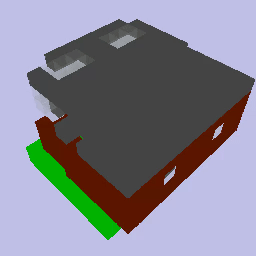
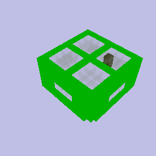
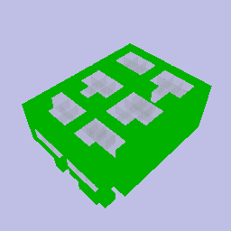
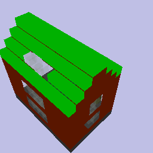
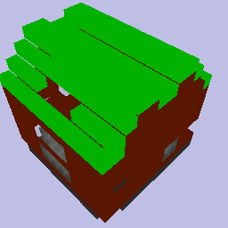
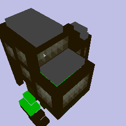
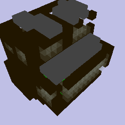

# A 3D voxel VAE for generating Minecraft buildings

A volumetric VAE trained on voxel blocks of a discrete type for the purpose of generating voxel buildings for Minecraft and other games. The architecture utilizes [Voxception](https://arxiv.org/pdf/1608.04236.pdf) layers that contain 3D convolutions and a form of spatial [3D attention](https://arxiv.org/pdf/2104.00985.pdf). For downscaling, the Voxception paper defines special layers, while upscaling is done with a simple tensor upsample in combination with standard Voxception layers to [avoid the issues with "Deconvolution" and ConvTranspose operations](https://distill.pub/2016/deconv-checkerboard/) that can manifest in this case as well during the early stages. 

Since instead of outputting data with a continuous value range like images, we are handling voxels which contain a discrete nominal value from a set of possible values, we output a categorical probability distribution across all block types per voxel instead of the usual output of one pixel value and use cross entropy loss instead of mean square error. 

Training is done on the 3Dcraft dataset which contains various buildings from the [Craftassist project](https://craftassist.s3-us-west-2.amazonaws.com/pubr/house_data.tar.gz). Since about 92% of the dataset's volume consists of air, a standard training approach will usually converge towards returning a voxel grid entirely filled with air at 92% accuracy. To mitigate this, the whole loss function is modified. The difference in probabilities of the air class is handled separately, with an additional factor of ~8-16. This is also the reason for occassional small jumps in the training curve of the plain autoencoder. The input voxel grids of the dataset are augmented by flipping them across the X and Y axes (Z axis being the height) to simulate a simple rotation and extend the dataset but also to regularize the neural network. 

The difference between the VAE and the autoencoder is that the model is first trained as an autoencoder (very high reproduction accuracies like 98%-99% should be achieved at this stage for decent results at the end) and then a sampling layer is inserted and everything retrained from scratch with a few hyperparameters adjusted. Instead of feeding integer values for each voxel, the input data is first converted into embeddings as has been suggested by the [World-GAN paper](https://arxiv.org/pdf/2106.10155.pdf), which improves performance.

# Some of the results
Interpolation between buildings: 

 

Variation on input buildings: 

| Original | Prediction
|----|----
| | 
| | 
| | 

# License
See LICENSE file.